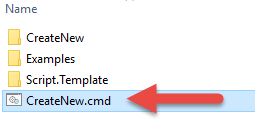
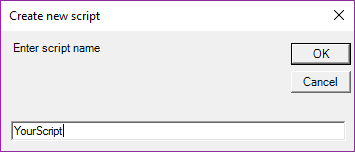
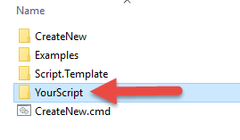
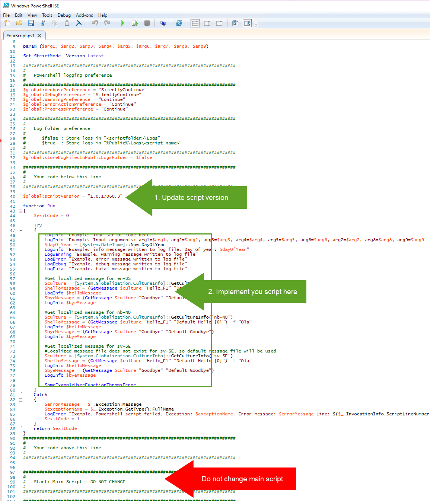
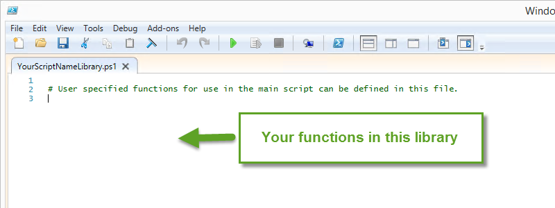
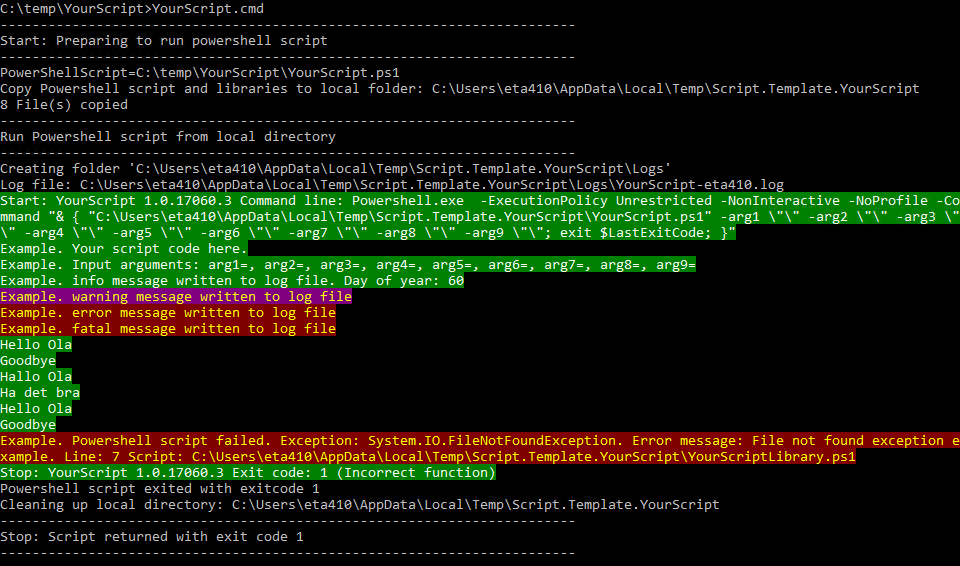

# Script.Template

PowerShell script template

## Features

* Logging to file using Log4Net
* Runs from UNC path by local copy workaround
* Exit code handling
* Input argument handling
* Localization of text strings

## Usage

1. Run CreateNew.cmd  

2. Enter script name  

3. Script template is copied and  renamed into a folder with name you just entered  

2. Develop your code in the Run function in YourScript\YourScript.ps1.
  1. Make sure to return a relevant exit code. Exit code 0 is normally regarded as success.
  2. Also consider updating the script version.  

3. Develop any user defined functions in YourScriptLibrary.ps1 to keep the main script clean  

4. To execute your script, run: YourScript.cmd "yourexampleparameter1" "yourexampleparameter2"  
  
5. Log file is located here: "%public%\Logs\YourScript\YourScript-%USERNAME%.log" or in "...\YourScript\Logs\YourScript-%USERNAME%.log" depending on the boolean value of $global:storeLogFilesInPublicLogsFolder

## Examples

* [AddCurrentUserToGroup.ps1](./src/Examples/AddCurrentUserToGroup)
This script supports adding current user to a specified Active Directory group

* [SetWallPaperWithText.ps1](./src/Examples/SetWallPaperWithText)
Write a text (spesified in a text file) to the copy of an image and then set the resulting image as wallpaper. The script uses a inline C# class utilizing the ImageMagick .NET library Magick.NET

## Logging

The script template utilize Log4Net to provide industry standard logging.

Default is logging to console (ColoredConsoleAppender) and logging to file (RollingFileAppender) enabled in the configuration file.

The configuration file can be modified with other appenders such as 

* EventlogAppender for logging to Eventlog 
* SmtpAppender for loggin to mail. Typically you will in this case configure only fatal error messages to be sent by mail.

Configuration of Log4Net appenders are described here: https://logging.apache.org/log4net/release/config-examples.html
