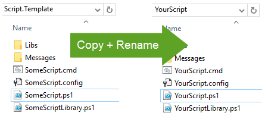
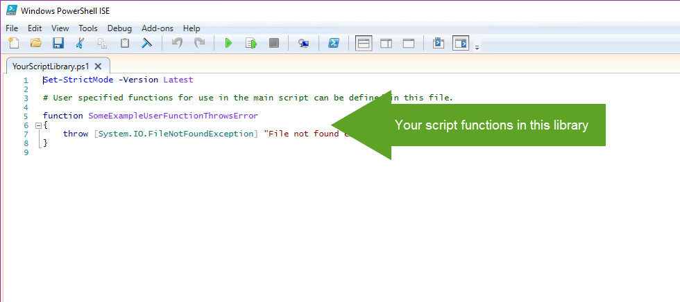

# Script.Template

PowerShell script template

## Features

* Logging to file using Log4Net
* Runs from UNC path by local copy workaround
* Exit code handling
* Input argument handling
* Localization of text strings

## Usage

1. Copy template to new folder YourScript
2. Rename SomeScript.cmd -> YourScript.cmd
3. Rename SomeScript.config -> YourScript.config
4. Rename SomeScript.ps1 -> YourScript.ps1
5. Rename SomeScriptLibrary.ps1 -> YourScriptLibrary.ps1

6. Rename Messages\SomeScriptMessages.psd1 -> Messages\YourScriptMessages.psd1
7. Rename Messages\<culture>\SomeScriptMessages.psd1 -> Messages\<culture>\YourScriptMessages.psd1

8. Develop your code in the Run function in YourScript.ps1. Make sure to return a relevant exit code. Exit code 0 is normally regarded as success. Also consider updating the script version.

9. Develop any user defined functions in YourScriptLibrary.ps1 to keep the main script clean

10. To execute your script, run: YourScript.cmd "yourexampleparameter1" "yourexampleparameter2"

11. Log file is located here: "%public%\Logs\YourScript\YourScript-%USERNAME%.log" or in "<ScriptFolder>\Logs\YourScript-%USERNAME%.log" depending on the boolean value of $global:storeLogFilesInPublicLogsFolder

## Examples

* [AddCurrentUserToGroup.ps1](./src/Examples/AddCurrentUserToGroup)
This script supports adding current user to a specified Active Directory group

* [SetWallPaperWithText.ps1](./src/Examples/SetWallPaperWithText)
Write a text (spesified in a text file) to the copy of an image and then set the resulting image as wallpaper. The script uses a inline C# class utilizing the ImageMagick .NET library Magick.NET
